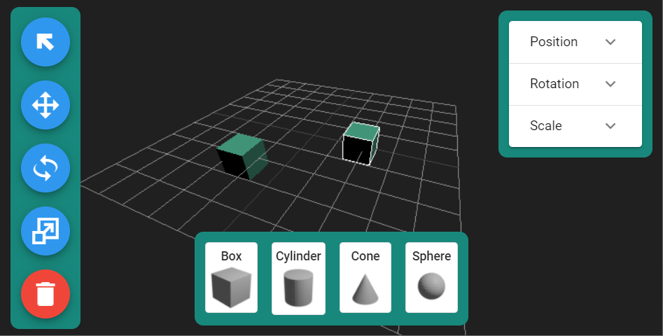

# 3D Shape Builder

Browser based editor for creating and transforming basic 3D solids.

Drag and drop 3D shapes onto the modeling plane. Drag and transform created shapes.

## Usage
Run applicaion at https://robertgz.github.io/3d-shape-builder/

* Drag any of the four shapes from the bottom toolbar up into the modeling plane to create a new shape.
  * Double click a shape on the toolbar to add it to the center of the modeling plane.
* Click and drag created shapes to move them within the modeling plane.
* Use the select tool to select or deselect shapes
  * Hold shift to select multiple shapes
* Modify the Position, Rotation, and Scale of selected shapes by expanding the desired property at the top right.
* Select shapes and use the Move, Rotate, and Scale tools to show the draggable transform gizmo.
* Select shapes and then click the red delete button or press the delete key to remove shapes from the drawing plane.

## Libraries used
* three.js
* Vue.js
* Vuex
* Vuetify.js

## Notes
* Works with recent desktop versions of Chrome and Firefox.
* Touch screen controls are not currently supported.
